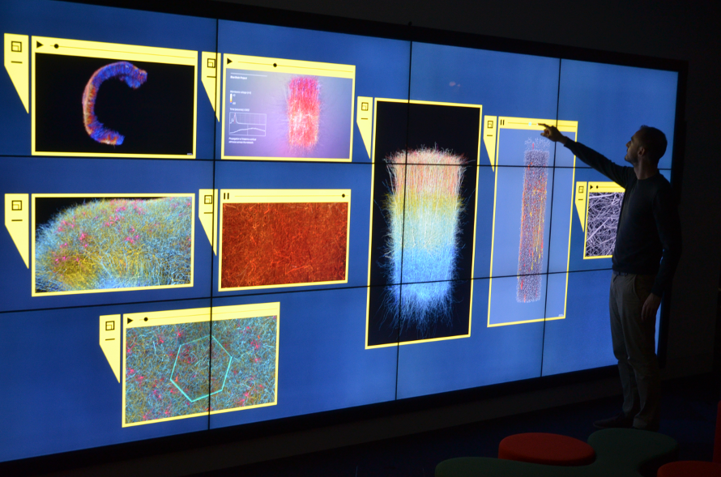
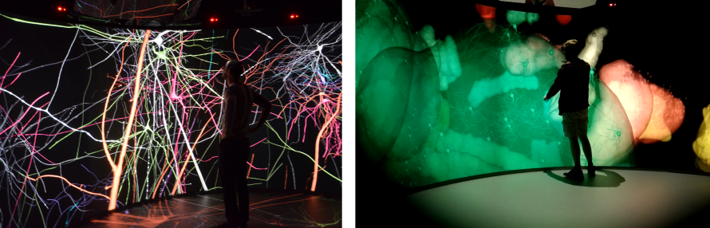
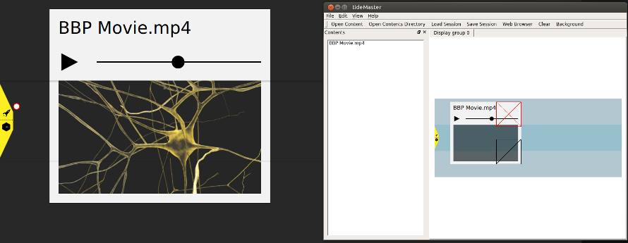
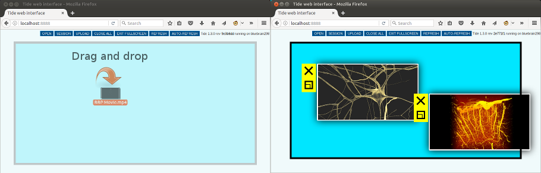

# Tide

Tide is BlueBrain's *Tiled Interactive Display Environment*. It provides
multi-window, multi-user touch interaction on large surfaces - think of a giant
collaborative wall-mounted tablet. See Tide in action in this [youtube
video](https://www.youtube.com/watch?v=wATHwvRFGz0).

## Features

Tide is a distributed application that can run on multiple machines to power
display walls or projection systems of any size.

Its user interface is designed to offer an intuitive experience on touch walls.
It works just as well on non touch-capable installations by using its web
interface from any web browser.

Tide helps users with:
* Presenting and collaborating on a variety of media such as high-resolution
  images, movies and pdfs.
* Sharing multiple desktop or laptop screens using the
  [DesktopStreamer](https://github.com/BlueBrain/Deflect/releases) application.
* Sketching new ideas by drawing on a whiteboard and browsing websites.
* Interacting with content streamed from remote sources such as high-performance
  visualisation machines through the
  [Deflect](https://github.com/BlueBrain/Deflect.git) protocol. In particular
  all [Equalizer](https://github.com/Eyescale/Equalizer)-based applications
  as well as [Brayns](https://github.com/BlueBrain/Brayns) ray-tracing engine
  have built-in support.
* Viewing high-resolution, immersive [stereo 3D streams](https://git.io/fpsoQ)
  on compatible hardware.

## Usage

Run 'tide' from the bin folder to start the application. By default it launches
three wall processes in a horizonal layout. Content can be opened from the
control user interface or by opening the web interface at
[http://localhost:8888](http://localhost:8888).

On a touch wall, click the rocket icon on the left control bar to browse for
contents and applications. Touch points are received via the TUIO protocol on
port 1701. To simulate a touch interface, build and run the SimpleSimulator
application or download any client from [TUIO](http://www.tuio.org/?software).
On a smartphone, search for *TuioPad* app.

For more detailed information refer to the
[User Guide](http://bluebrain.github.io/Tide-1.5/user_guide.html).

## Web Interface

The application can be entirely controlled from the web interface or even using
direct REST API calls. Simply drag and drop a file to upload it to the wall.

## Getting Tide

A pre-built Ubuntu 18.04 package is available from the
[releases](https://github.com/BlueBrain/Tide/releases) page.
Download it and install it with:

    sudo apt install ./tide_1.5.0~bionic_amd64.deb

Please note that there are some stability issues with the system Qt packages
affecting notably the web browser. We recommend installing Qt 5.9.7 from the
[official website](https://download.qt.io/archive/qt/5.9/5.9.7/). To use it,
add the following to your .bashrc:

    QT_HOME=/home/$USER/Qt5.9.7/5.9.7/gcc_64
    export PATH=$QT_HOME/bin:$PATH
    export LD_LIBRARY_PATH=$QT_HOME/lib:$LD_LIBRARY_PATH
    export QML_IMPORT_PATH=$QT_HOME/qml

For other platforms, see next section for building from source.

## Building from Source

Basic procedure on Linux / OSX:

    git clone --recursive https://github.com/BlueBrain/Tide.git
    mkdir Tide/build
    cd Tide/build
    cmake -GNinja -DCLONE_SUBPROJECTS=ON ..
    ninja

The master branch always contains the latest development features; see
[Changelog](https://git.io/fpsK1).
To build a stable [release](https://github.com/BlueBrain/Tide/releases)
checkout its tag:

    git checkout 1.5.0

Tide uses a set of [common CMake modules](https://github.com/Eyescale/CMake) to
help with the configuration and handling of dependencies. To install required
system packages on Ubuntu (apt-get) or OSX (macports) run:

    cmake .. -DINSTALL_PACKAGES=ON

For detailed instructions on how to build Tide on a specific platform refer to
[Building Tide](http://bluebrain.github.io/Tide-1.5/building.html).

## Similar Projects

Tide is the direct successor of
[DisplayCluster](https://github.com/TACC/DisplayCluster) at BlueBrain. Most of
the code has been rewritten based on Qt's Qml2 engine and multithreaded
operations for greatly optimized performance and stability.

It offers a modern alternative to [Sage/Sage2](http://sagecommons.org) built on
proven and efficient technologies (C++14, Qt5, MPI).

## Documentation

The full documentation is available at
[bluebrain.github.io](http://bluebrain.github.io/Tide-1.5)

## Funding & Acknowledgment

The development of this software was supported by funding to the Blue Brain Project,
a research center of the École polytechnique fédérale de Lausanne (EPFL), from the
Swiss government’s ETH Board of the Swiss Federal Institutes of Technology.

This project has received funding from the European Union's Horizon 2020 Framework
Programme for Research and Innovation under the Specific Grant Agreement No. 720270
(Human Brain Project SGA1).

This project is based upon work supported by the King Abdullah University of Science
and Technology (KAUST) Office of Sponsored Research (OSR) under Award No. OSR-2017-CRG6-3438.

## License

Copyright (c) 2013-2021 Blue Brain Project/EPFL,

Copyright (c) 2013-2015 King Abdullah University of Science and Technology,
                        Saudi Arabia

Copyright (c) 2011-2012 The University of Texas at Austin.

All rights reserved.

The views and conclusions contained in the software and documentation are those of
the authors and should not be interpreted as representing official policies, either
expressed or implied, of École polytechnique fédérale de Lausanne de Lausanne.
